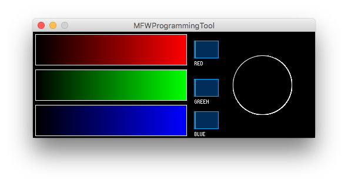

# MFWProgrammingTool

A minimal RGB slider control for the Modes firmware.

## Known Issues
- The RGB Fields currently allow non-integer values. This should be changed to be more user-friendly in the future.
- Hitting the enter/return key while focused on any of the text fields causes the field to get cleared. In the future, pressing enter should move to the next field.
- You cannot use the tab key to move to the next field.

## License
The MFWProgrammingTool is licensed under the [MIT License](README.md).